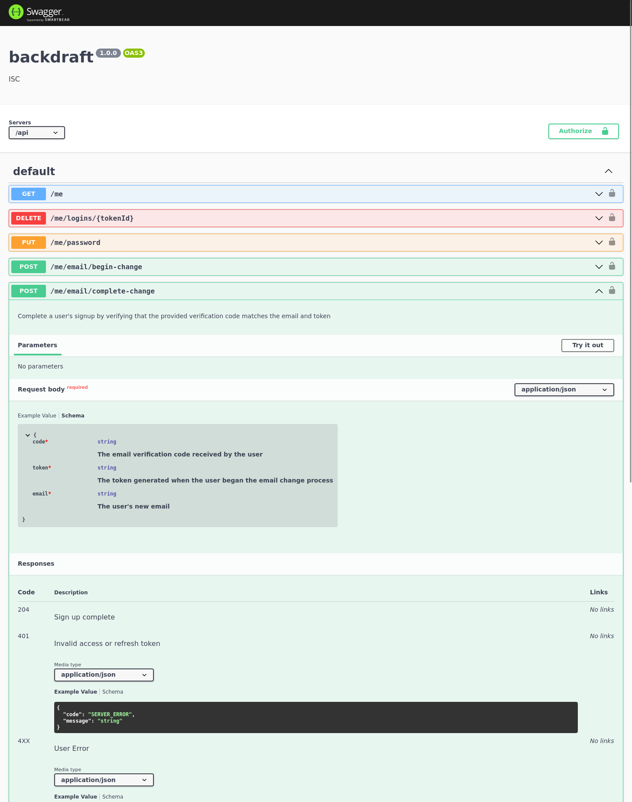

# 🔥 Backdraft

Node.js, Express, and PostgreSQL based web server with simple user authentication, to be used as a template or starting off point for backend projects.

    

***[Frontload](https://github.com/ImranR98/Frontload)* is the frontend counterpart to this project.**

## Why
Most web service backends share certain basic features — they usually involve exposing HTTP endpoints that allow for CRUD operations on a database, protected via some kind of authentication.

Repeatedly implementing these basic features from scratch with each new project, especially when your projects share the same stack, is a waste of time and can lead to rushed or inconsistent code. For example, a common mistake or shortcut is to avoid using refresh tokens for authentication, and to instead issue only regular JWTs with ridiculously long expiration times, leading to security risks and poorer UX. Additionally, features like automated testing, logging, and email verification are often skipped to save time.

This project helps avoid such issues by providing a solid foundation that includes the basics right out of the box in a well documented, maintainable, and extensible way.

## Features

- User authentication using JWT and refresh tokens.
- Ability for authenticated users to manage their credentials and refresh tokens.
- Auto generated OpenAPI spec and Swagger UI endpoint using tsoa and Swagger-UI-Express.
- Automated testing for all API endpoints using Mocha, Chai, and SuperTest
- Standardized logging using Winston and Morgan.
- Prisma and TypeScript used for easier database management and increased type safety.
- User email verification and password reset enabled by Nodemailer.

## Setup/Usage & Environment
1. Use `npm i` to install required dependencies.
2. Create a copy of `template.env`, rename it to `.env`, and fill in the appropriate details for your development environment, as described in that file. Refer to the `dotenv` [documentation](https://www.npmjs.com/package/dotenv) for details on how this works. Rename `template.test.env` to `.test.env` and repeat the process for your test environment - this usually involves defining a separate database to run tests on. Any variables not defined in `.test.env` will fall back to the values in `.env`. It is assumed that you will not use a `.env` file to set environment variables in production.
3. Ensure the development and test databases (as were defined in the `.env` files) are running and reachable, along with the production database when needed.
4. Test the project, build it for production, or run it in a development environment using the scripts defined in `package.json`.

By default, all endpoints are located in `/api`, and the Swagger UI endpoint is `/api/docs`.

## Project Structure

### DB

The `prisma` directory contains a database schema definition used by the [Prisma](https://www.prisma.io/) ORM. 

The `prismaClient.ts` file in the `db` directory defines and exports a Prisma client objects that can be used in the application.

The remaining files in the `db` directory define various query functions that are used to make changes to the database. This means that the database layer is abstracted away and can be swapped out later if needed, without changing the services.

Note that this layer has minimal validation as this is mostly done in the services.

### Services

Each file in the `services` directory contains a set of functions, each of which carries out some task related to the application's use. Such functions normally involve accepting input that was received from the client, querying or modifying the database using the functions exposed by the database layer, and returning a result.

The functions are grouped into service files based on a shared theme or aspect of functionality. For example, all functions related to authentication are stored in `authService.ts`.

Services contain the vast majority of application logic; anything used directly to respond to requests is generally stored in a controller.

### Controllers

Each file in the `controllers` directory contains a set of [tsoa](https://tsoa-community.github.io/docs/) controllers. They are grouped according to the route path; for example, `meControllers.ts` contains all controllers used that define routes directly under `/me`. 

Each tsoa controller defines a request route, the expected request body and/or parameters, and the expected output. It then calls some service function and returns the result or an error. Controllers should also contain JSDoc comments to help document each route for the OpenAPI spec.

### Helpers

The `helpers` directory contains helper functions that do not fit in any other directory. Examples include email related functions and JWT encode/decode functions.

### Interfaces

The `interfaces` directory contains TypeScript interfaces that are used in Service files. Aside from helping with type safety, these are also used by tsoa to generate a more well-defined OpenAPI spec.

### Everything Else

The remaining files in `/src` include:
- `authentication.ts` - defines authentication functions used by tsoa to protect specific routes.
- `environment.ts` - provides a function to ensure the required environment variables exist at runtime.
- `logger.ts` - configures the Winston logger.
- `app.ts` - configures the Express app.
- `server.ts` - The main server process.

## Typical Flow for Implementing New Features

Implementing new functionality in the application usually involves:
1. Updating the Prisma schema as needed and performing a DB migration accordingly (by running `npx prisma migrate deploy`).
2. Implementing the relevant services (and interfaces if needed)
3. Adding the relevant controllers
4. Implementing fuctional tests for the new endpoints
5. Testing

## Testing
Each `.test.ts` file in the `test` directory contains functional Mocha tests for a particular set of server endpoints. All root hook plugins are in `hooks.ts`.

In principle, each test should be fully independent and isolated from others. This means that there should be a root hook plugin that connects to an empty test database (that should be prepared beforehand and defined in an environment variable). This also means that, for example, a test that requires the existence of a logged in user would need a "test" user to be created first in `before` or `beforeEach` hooks. Such commonly used "preparation" functions are kept in `testData.ts`.

## Auto-generated API Docs - Screenshot Example

------

Current concerns, ideas, and other notes are in [Notes.md](./Notes.md).
